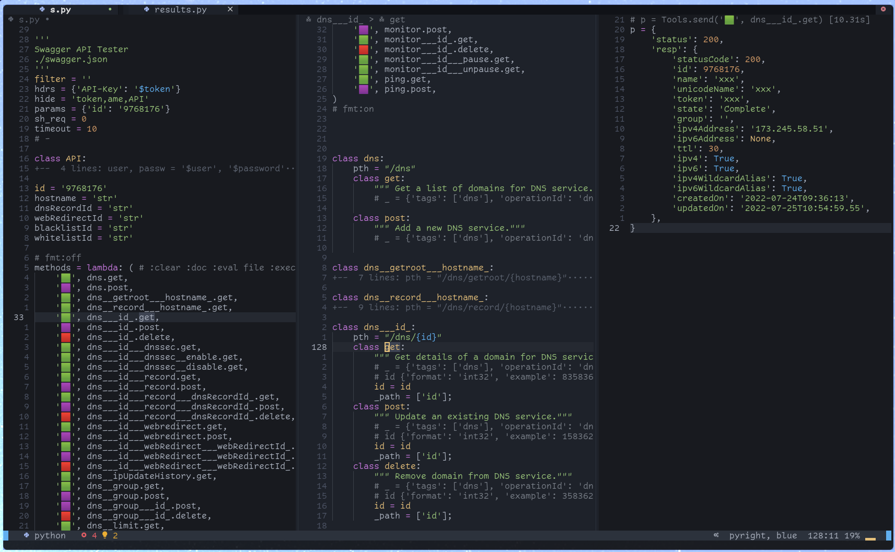

# Vim Python Eval

<!--toc:start-->
- [Vim Python Eval](#vim-python-eval)
  - [Usage](#usage)
  - [Features](#features)
    - [Directives](#directives)
    - [Result Display](#result-display)
    - [Predefined Blocks (Macros)](#predefined-blocks-macros)
    - [Markdown Fenced Blocks](#markdown-fenced-blocks)
  - [Interacting with Swagger APIs](#interacting-with-swagger-apis)
  - [Installation](#installation)
<!--toc:end-->

vim/neovim [can][hot] 'hot evaluate' code using e.g. `:py print("hello")`. 

[hot]: https://vim.fandom.com/wiki/Execute_Python_from_within_current_file

This module adds

- Output handling 
    - within a split window (a buffer, incl. undo)
    - as valid python (lsp support, e.g. for re-formatting)
- Support for various [evaluation and output control directives](#directives)
- Loadable predefined python code blocks
- Hot reload of this module's code, w/o state loss
- More convience regarding evaluation of lines within code blocks


The module also offers [built in support](./docs/swagger.md) for interaction with Swagger/OpenAPI APIs




## Usage

- Hit the hotkey (e.g. `,r`) on a line or visually selected range, which you want evaluated.
- The line may be a filename or URL of a swagger definition, resulting in code generation for a
  python requests based API client (see [here](./docs/swagger.md))
- When the evaluated block contains assignments to `p` or `y`, their values are shown pretty printed
  or as yaml within a vertical split window. As are evaluation errors.
- If the evaluated line is part of a block (e.g. a line within a function), then the whole block is evaluated by default.
- Invocations of the `print` function result in print outs within vim's status window.
- Previously evaluated lines are remembered, i.e. state is kept between evaluations.
- Objects or classes within result structures are walked for their attributes, when printing them

Notes:
- Evaluated code may even reside within docstrings or markdown code blocks - as long as you omit the
  comment delimiters from the evaluation, all assignements make it into the next evaluation state.
- vim calls the python code syncronously, blocking. You have to kill the python process to unblock
  it, should your code block forever, while executing.


## Features

### Directives

Supported (usually in comment blocks) are:

- `:all`: The whole source module is evaluated before the single line is
- `:clear`: The previous result is removed
- `:cmt <comment>`: Show the given comment string
- `:doc`: Show the evaluated block in the result window
- `:[no]autodoc`: The `:doc` directive is set/removed for all subsequent evaluations
- `:[no]always`: When set, then all directives of this eval run are remembered for future runs, until `:noalways` is set
- `:single`: Only the line on the cursor is evaluated, even if within a bigger block (see swagger) 
- `:state`: Add the evaluation state to result (shows all assigned variables)
- `:wrap <code>`: The line is wrapped into code, replacing the string '{}' (see swagger)


### Result Display

Assign the following variables and evaluate to influence how results are shown:

- `p = <result>` or `y = <result>`: Pretty print or yaml dump any object, incl. attributes 
- `filter="<list of match strings>"`: Recursively scans the result structure and only shows key OR
  values (substring-)matching any of the filter. 
  A filter value '1' results in all list reduced to their first item. 
- `hide="<list of match strings>"`: Recursively scans the result structure and "x-out" values, whose
  keys(!) match any of the hide strings. Intended to not show passwords and the like in demos.

```python :clear
filter = 'bar,1'
hide = 'bar'
m = {'u': 23, 'a': [{'foo': {'bar': 23, 'baz': 23}}, {'other': 42}]}
p = m   # :doc
```

result pane:

```python
# 2 keys filtered, matching [bar,1]
p = {'a': [{'foo': {'bar': 'xxx'}}, '...[2 items]]}
```


### Predefined Blocks (Macros)

Note: At this time this feature does NOT offer anything more than a good snippets tool, i.e. you
probably do NOT need it. I was just adding it, in order to have those available on `cow style` machines
without a sophisticated vim setup.

If you hit the hotkey on an empty line we present a list of predefined code blocks, for quick adds
into the source code window.

You may extend that list by your own "macros" like so:


```python
~ ❯ cat .config/vpe/macros.py                                                                                    tools
d = """
'Demo user macro'
import time
print('Hello', time.time())
"""

macros = {'demo': d}
```

[](https://asciinema.org/a/057ewOGytqJDGEL6DF9Ck1hDw)

### Markdown Fenced Blocks

Fenced code blocks are evaluated in total if you evaluate the first line, starting with 3 fences
(also indented)

```
    ```python  :clear :always
    import os
    p = os.popen('uname -a').read()
    ``

```

Since state is kept also cross buffers, you might e.g. define helper functions for presentations
centrally, which you can later use in your presentation files.


## Interacting with Swagger APIs

See [here](./docs/swagger.md)


## Installation

1. Install this plugin "axiros/vpe" 
2. Configuration:

Define a hotkey for invoking it in normal and visual mode, e.g.:

```vim
nnoremap          ,r  :Vpe<CR>
xnoremap <silent> ,r  :Vpe<CR>
```

This lazy loads the module on first use.

### Requirements

- Should work for vim and neovim with python3 support.
- Autoformatting of results only in neovim.
- For filetype python we assume these requirements in your config:
- `set foldmethod=indent` should be set, since we collapse classes after creating swagger support
   definitions.


## Developing

Set `let g:vpe_reload=1` to enable reloading the module at every invokation. 
State, e.g. evaluated imports, is kept in dict `ctx.state`.

In order to run tests w/o vim, just touch an empty `vim.py` next to the module (or pip install it).

## Troubleshooting

### A lib in my venv/conda env cannot be imported

1. pynvim (or neovim), the vim api we use, is usually installed into somewhere like  `~.local/lib/python3.9/site-packages/pynvim`.
2. thy `python3` command of [n]vim searches your $PATH for the available python of that major
   version. It might decide to use the wrong one, if your venv's version does not match.

You can evaluate `p = sys.executable, sys.path` to get more information about the python in use
within [n]vim.

Example result:
```python
p = (
    '/home/gk/nvim/bin/python3',
    [
        '/home/gk/.local/share/nvim/site/pack/packer/start/vpe/plugin',
        '/home/gk/nvim/lib/python310.zip',
        '/home/gk/nvim/lib/python3.10',
        '/home/gk/nvim/lib/python3.10/lib-dynload',
        '/home/gk/nvim/lib/python3.10/site-packages',
        '_vim_path_',
    ],
)
```

=> You can try `pip install pynvim` or `pip install neovim` version for your python OR pull the venv up or down to the
major you have for pynvim.

### gevent monkey patch causes trouble

If evaluated code wants to "monkey patch" the whole interpreter, then [n]vim fails with an error
message about execution outside the main thread.

Workaround:

If you cannot avoid the monkey path, then try command out the check in nvim.py's request function:

```python
        # if (self._session._loop_thread is not None
        #         and threading.current_thread() != self._session._loop_thread):
        #     msg = ("Request from non-main thread.\n"...)
        #     self.async_call(self._err_cb, msg)
        #     raise NvimError("request from non-main thread")
```


## Credits, Alternatives, Interesting Links

(neo)vim with python support.

Inspiration from this: [vim-http-client](https://github.com/aquach/vim-http-client)

Powerful alternative: [jupyter-vim](https://github.com/jupyter-vim/jupyter-vim)

OpenAPI:

- Tools: https://openapi.tools/
- Generation UI, with import function: https://www.apibldr.com/
- Their default gen tool: https://github.com/OpenAPITools/openapi-generator


