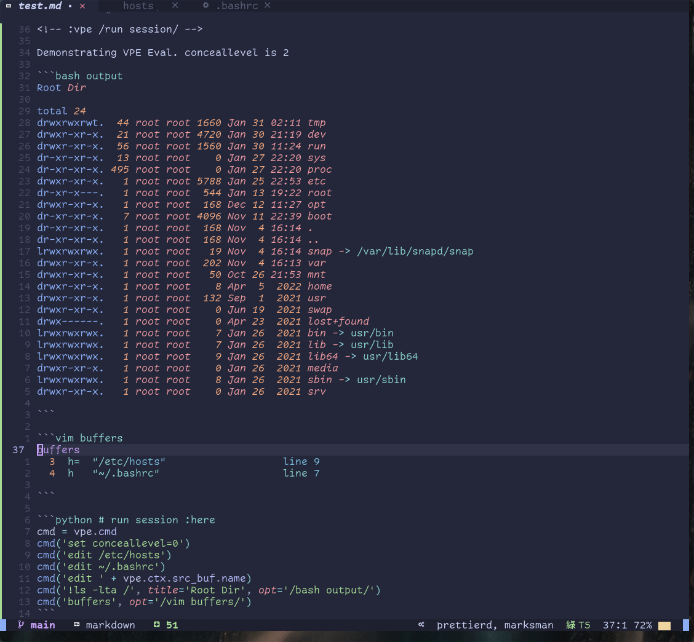

# Vim Python Eval

<!--toc:start-->

- [Vim Python Eval](#vim-python-eval)
  - [Usage](#usage)
  - [Features](#features)
    - [Directives](#directives)
    - [Result Display](#result-display)
    - [Predefined Blocks (Macros)](#predefined-blocks-macros)
    - [Markdown Fenced Blocks](#markdown-fenced-blocks)
    - [Global Variables](#global-variables)
      - [vpe.vim](#vpevim)
      - [vpe.ctx](#vpectx)
      - [vpe.cmd](#vpecmd)
      - [vpe.fnd](#vpefnd)
      - [vpe.notify](#vpenotify)
    - [Modules](#modules)
      - [Builtin Modules](#builtin-modules)
        - [Interacting with Swagger APIs](#interacting-with-swagger-apis)
    - [Add on: Non Python Call Syntax](#add-on-non-python-call-syntax)
      - [Into Split Window](#into-split-window)
      - [Into Current Buffer](#into-current-buffer)
      - [Jump References](#jump-references)
        - [Sample Use Cases](#sample-use-cases)
        - [Example](#example)
        - [Examples](#examples)
  - [Installation](#installation)
    - [Requirements](#requirements)
  - [Developing](#developing)
    - [Automatic Testing](#automatic-testing)
  - [Troubleshooting](#troubleshooting)
    - [A lib in my venv/conda env cannot be imported](#a-lib-in-my-venvconda-env-cannot-be-imported)
    - [gevent monkey patch causes trouble](#gevent-monkey-patch-causes-trouble)
  - [Credits, Alternatives, Interesting Links](#credits-alternatives-interesting-links)
  <!--toc:end-->

Documents which can "do" stuff may come handy sometimes - this is python centric approach.

👓 General statement: _Try use built in mechanics instead of plugins - they are *pretty* powerful:_

- vim/neovim [can][hot] 'hot evaluate' code using e.g. `:py print("hello")` or `:!ls -lta /`.
- Also it can insert files into the buffer quite easily: `:read /etc/hosts`
- It can also redir command output into the current buffer (`h redir`)
- (...)

[hot]: https://vim.fandom.com/wiki/Execute_Python_from_within_current_file

This plugin offers

- Output handling
  - within a split window (a buffer, incl. undo history) or inline
  - as valid python (i.e. with lsp support, e.g. for re-formatting)
- Various [evaluation and output control directives](#directives)
- Loadable predefined python code blocks
- Hot reload of this plugin's python module code, w/o state loss
- Some convience regarding evaluation of lines within code blocks


Access to vim api & jumps:

|                         |                           |
| ----------------------- | ------------------------- |
| after open:             | after eval of first line: |
|  |   |

Also, the module offers [built in support](./docs/swagger.md) for interaction with Swagger/OpenAPI APIs


## Usage

- Hit the hotkey (e.g. `,r`) on a line or visually selected range, which you want evaluated.
- The line may be a filename or URL of a swagger definition, resulting in code generation for a
  python requests based API client (see [here](./docs/swagger.md))
- When the evaluated block contains assignments to `p` or `y`, their values are shown pretty printed
  or as yaml within a vertical split window. As are evaluation errors.
- If the evaluated line is part of a block (e.g. a line within a function), then the whole block is evaluated by default.
- Invocations of the `print` function result in print outs within vim's status window.
- Previously evaluated lines are remembered, i.e. state is kept between evaluations.
- Objects or classes within result structures are walked for their attributes, when printing them

Notes:

- Evaluated code may even reside within docstrings or markdown code blocks - as long as you omit the
  comment delimiters from the evaluation, all assignements make it into the next evaluation state.
- vim calls the python code syncronously, blocking. You have to kill the python process to unblock
  it, should your code block forever, while executing.

## Features

### Directives

Supported (usually in comment blocks) are:

- `:all`: The whole source module is evaluated before the single line is
- `:clear`: The previous result is removed
- `:cmt <comment>`: Show the given comment string
- `:doc`: Show the evaluated block in the result window
- `:here`: Show the result under the current line in the source buffer (no split)
- `:[no]autodoc`: The `:doc` directive is set/removed for all subsequent evaluations
- `:[no]always`: When set, then all directives of this eval run are remembered for future runs, until `:noalways` is set
- `:silent`: Skip showing results at all
- `:single`: Only the line on the cursor is evaluated, even if within a bigger block (see swagger)
- `:state`: Add the evaluation state to result (shows all assigned variables)
- `:stop`: Evaluate only to this point in a block
- `:vpe_on_any`: Occurring at header or footer of files (3 lines), this line will be evaluated if no python under cursor
- `:vpe_on_err`: Occurring at header or footer of files (10 lines), this line will be evaluated on exceptions
- `:wrap <code>`: The line is wrapped into code, replacing the string '{}' (see swagger)

### Result Display

Assign the following variables and evaluate to influence how results are shown:

- `p = <result>` or `y = <result>`: Pretty print or yaml dump any object, incl. attributes
- `filter="<list of match strings>"`: Recursively scans the result structure and only shows key OR
  values (substring-)matching any of the filter.
  A filter value '1' results in all list reduced to their first item.
- `hide="<list of match strings>"`: Recursively scans the result structure and "x-out" values, whose
  keys(!) match any of the hide strings. Intended to not show passwords and the like in demos.

```python :clear
filter = 'bar,1'
hide = 'bar'
m = {'u': 23, 'a': [{'foo': {'bar': 23, 'baz': 23}}, {'other': 42}]}
p = m   # :doc
```

result pane:

```python
# 2 keys filtered, matching [bar,1]
p = {'a': [{'foo': {'bar': 'xxx'}}, '...[2 items]]}
```

Note: When you set `:here` then the result will be NOT shown in a split window but within the source buffer, below the current line.

### Predefined Blocks (Macros)

Note: At this time this feature does NOT offer anything more than a good snippets tool, i.e. you
probably do NOT need it. I was just adding it, in order to have those available on `cow style` machines
without a sophisticated vim setup.

If you hit the hotkey on an empty line we present a list of predefined code blocks, for quick adds
into the source code window.

You may extend that list by your own "macros" like so:

```python
~ ❯ cat .config/vpe/macros.py
d = """
'Demo user macro'
import time
print('Hello', time.time())
"""

macros = {'demo': d}
```

[](https://asciinema.org/a/057ewOGytqJDGEL6DF9Ck1hDw)

### Markdown Fenced Blocks

Fenced code blocks are evaluated in total if you evaluate the first line, starting with 3 fences
(also indented)

````
    ```python  :clear :always
    import os
    p = os.popen('uname -a').read()
    ``

````

Since state is kept also cross buffers, you might e.g. define helper functions for presentations
centrally, which you can later use in your presentation files.

### Global Variables

Under the namespace class `vpe` the following variables are always available at python execution time:

👓 Eval this to access them:

```python
p = dir(vpe)
```

#### vpe.vim

Access to the pynvim API. Alternative: `import vim`.

```python
p = vpe.vim.version #:here
# prints when evaluated:
p = Version(api_compatible=0, api_level=10, api_prerelease=False, major=0, minor=8, patch=1, prerelease=False)
```

#### vpe.ctx

- `ctx`.`state`: Evaluation state
- `ctx`.`src_buf`: Reference to source buffer
- `ctx`.`L1`, `L2`: Lines selected

You can explore those e.g. via `p = dir(ctx) # :here`

#### vpe.cmd

```python
vpe(<vim cmd>, silent=True, title=<False, True, string>, opt='')
```

Executes vim command and redirects to a file. The file is then ALWAYS redirected to the
current buffer, relative to current line. `opt` forwarded to the read as opt (`:h read`).

#### vpe.fnd

Convenience function to deliver dir and full path of source buffer:

    vpe.fnd().here  / vpe.fnd().fn

❗If you `os.chdir`, be aware that this happens in a python subprocess of vi. Vi itself does not change dir.

=> Use sth like this in vim.cmd: `vpe.cmd(f'edit {os.getcwd()}/myfile')`

#### vpe.notify

Calls the notify-send utility.
If you use growl or other tools, symlink or wrap them e.g. at `/usr/local/bin/notify-send`

```python
vpe.notify('title', 'optional msg') # calls notify-send "title" "o. msg"
```

### Modules

This hands over evaluation to external modules.

Builtin module currently: swagger/openapi (see below).

Call syntax:

`<module name>  [argument]`

That call syntax you may also apply on the command line:

Example: Instead of evaluating `swagger ./hcloud.json` in vi you can call the module on the CLI with those args:

```bash
gk@axgk hetzner]$ alias vpe
alias vpe='/home/gk/.local/share/nvim/site/pack/packer/start/vpe/plugin/vim_python_eval.py'
[gk@axgk hetzner]$ vpe
no vim api importable
Call me with <module name> <file or url>. Modules: ['swagger', 'openapi']
[gk@axgk hetzner]$ rm -f client_hcloud.py; vpe swagger ./hcloud.json
no vim api importable
Have written: client_hcloud.py
[gk@axgk hetzner]$ cat client_hcloud.py | grep -A 10 methods
methods = lambda: ( # :clear :doc :all :single :wrap p = Tools.send({})
 '🟩', actions.get,
 '🟩', actions___id_.get,
 '🟩', certificates.get,
 '🟪', certificates.post,
 '🟥', certificates___id_.delete,
 '🟩', certificates___id_.get,
 '🟧', certificates___id_.put,
 '🟩', certificates___id___actions.get,
 (...)
```

#### Builtin Modules

##### Interacting with Swagger APIs

See [here](./docs/swagger.md)

### Add on: Non Python Call Syntax

#### Into Split Window

A function evaluating _anything_ into a split window is also included within this plugin:

Add `nnoremap  ,E  :EvalInto<CR>` to your mappings and get the evaluation result of the current
line into a split window, named like the command:

[](https://asciinema.org/a/EkeLpbjEBbqH34PegKGda0TqG)

The function is using only built in vim mechanics: Basically `put=execute(getline('.'))` plus a few
lines of buffername handling. No directives evaluated.

Tip: For repeated evals, you want to close the result buffers, using `:bw` (wipe)

#### Into Current Buffer

`,r` on a line starting with ':' (or after ':vpe ' anywhere in a line) evaluates the result into the buffer.

[](https://asciinema.org/a/N659bceuquJjDEZNtAnND22GP)

Note: When line starts with `<!--`, we split off closing `-->`

#### Jump References

Evaluating something like `:/foo.bar/` (at the beginning of a line) or `:vpe /foo.bar/`
(anywhere in a line) tries to find all lines below, (regex)matching `.*foo.bar` and evaluate, as if it was the cursor line
when hitting the hotkey.

This way you can hide code away, e.g. in presentations but still have it available.

If you say `/gg/foo.bar/` then searching for matches will happen not from the
line with the jump declaration but from the beginning of the file.

That way you can have a jump ref at the end of the file, possibly with a `:vpe_on_err` or `:vpe_on_any` directive.

##### Sample Use Cases

##### Example

```
 # My Live Markdown Doc
 ...
 func1()

 <!-- Code defined below, not visible for the viewer
 `` python @prepare-presentation
 # python code, executed when ,r is pressed *anywhere* (through vpe_on_any below)>
 vpe.on_any = False # disable for subsequent ,r in this whole vi session (until enabled again)
 func1 = lambda: do_something_useful() # will happen when u hit ,r on the line with func1 above
 ``

 :vpe /gg/@prepare-presentation/ # :vpe_on_any
 vi: fdl=1 fen
 end of document -->
```

##### Examples

Open this file in vi and hit `,r` on these lines (`P` the usual lua table dump function):

    :lua P(require('telescope.mappings').default_mappings)
    :hi
    :!ls -lta /
    :history

You get the idea.

Note: Directives `:vpe_on_err` or `:vpe_on_any` are understood behind ` # :` seperator (but before a closing `-->`)

## Installation

1. Install this plugin "axiros/vpe"
2. Configuration:

Define a hotkey for invoking it in normal and visual mode, e.g.:

```vim
nnoremap          ,r  :Vpe<CR>
xnoremap <silent> ,r  :Vpe<CR>
```

This lazy loads the module on first use.

### Requirements

- Should work for vim and neovim with python3 support.
- Autoformatting of results only in neovim.
- For filetype python we assume these requirements in your config:
- `set foldmethod=indent` should be set, since we collapse classes after creating swagger support
  definitions.

## Developing

Set `let g:vpe_reload=1` to enable reloading the module at every invokation.
State, e.g. evaluated imports, is kept in dict `ctx.state`.

In order to run "manual" tests w/o vim, just touch an empty `vim.py` next to the module (or pip install it).

### Automatic Testing

They require a [pds](https://github.com/AXGKl/pds) sandbox on your system, for test tools support.

Then you can [automate testing](./tests/test_pds.sh) based on a real vi running in tmux.

## Troubleshooting

### A lib in my venv/conda env cannot be imported

1. pynvim (or neovim), the vim api we use, is usually installed into somewhere like `~.local/lib/python3.9/site-packages/pynvim`.
2. thy `python3` command of [n]vim searches your $PATH for the available python of that major
   version. It might decide to use the wrong one, if your venv's version does not match.

You can evaluate `p = sys.executable, sys.path` to get more information about the python in use
within [n]vim.

Example result:

```python
p = (
    '/home/gk/nvim/bin/python3',
    [
        '/home/gk/.local/share/nvim/site/pack/packer/start/vpe/plugin',
        '/home/gk/nvim/lib/python310.zip',
        '/home/gk/nvim/lib/python3.10',
        '/home/gk/nvim/lib/python3.10/lib-dynload',
        '/home/gk/nvim/lib/python3.10/site-packages',
        '_vim_path_',
    ],
)
```

=> You can try `pip install pynvim` or `pip install neovim` version for your python OR pull the venv up or down to the
major you have for pynvim.

### gevent monkey patch causes trouble

If evaluated code wants to "monkey patch" the whole interpreter, then [n]vim fails with an error
message about execution outside the main thread.

Workaround:

If you cannot avoid the monkey path, then try command out the check in nvim.py's request function:

```python
        # if (self._session._loop_thread is not None
        #         and threading.current_thread() != self._session._loop_thread):
        #     msg = ("Request from non-main thread.\n"...)
        #     self.async_call(self._err_cb, msg)
        #     raise NvimError("request from non-main thread")
```

## Credits, Alternatives, Interesting Links

- (neo)vim with python support as a basis for your [PDE](https://www.youtube.com/watch?v=IK_-C0GXfjo)

- Inspiration for this: [vim-http-client](https://github.com/aquach/vim-http-client)

- Powerful alternative: [jupyter-vim](https://github.com/jupyter-vim/jupyter-vim)

- Godmode alternative (as always): [Emacs OrgMode + literate programming](https://www.offerzen.com/blog/literate-programming-empower-your-writing-with-emacs-org-mode)

- OpenAPI:

  - Tools: https://openapi.tools/
  - Generation UI, with import function: https://www.apibldr.com/
  - Their default gen tool: https://github.com/OpenAPITools/openapi-generator
