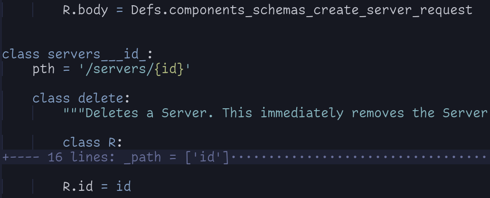

# OpenAPI / Swagger Support

Early phase. Manually tested against various swagger files, incl. the [petstore](https://petstore.swagger.io/) demo API.

See the [examples folder](../examples/) - the openapi test script runs them all.

[](https://asciinema.org/a/c1LyPn7dnI7mHXMWAbMVqcRqH)

Note: In the recording, the 'swagger' keyword was not required before the url. Meanwhile it is, see:

## Usage

1. On CLI: vpe <swagger|openapi> <url or file>
2. VI: After potential pre-parametrization, hit the hotkey on a line with "swagger <Swagger definition URL or filename>" =>

- All RPCs are listed, with references to parameter definitions (components).
- Path parameters are extracted and configured globally on module level (e.g. `petId` in the
  example).
- Definitions are wrapped into a `class Defs`
- API Methods as top level classes, referencing definitions.
- Tools for actual sending the requests within `class Tools` at the end - i.e. the module is
  completely self contained, requiring only pyaml if you want yaml output.

3. You can now parametrize and then send requests to the endpoint by hitting the hotkey on the methods.
4. Set `results` to

- 0 in order to only see request parameters w/o actually sending it
- 1 (default) to see the responses only
- 2 for both
- 3 shows the whole requests object, with all attributes resolved

5. Configure any authentication within `class API`. Environ variables are understood.
6. Directives are at the end of the `methods` block, ready for change.
   - Default: `# :clear :doc :all :single :wrap p = Tools.send({})`
   - Remove the `:clear` to not loose output of previous runs
   - Set `:wrap p = ...` to `:wrap y= ...` to get output as yaml

If you have downloaded a swagger definition into a file, press the hotkey on the filename

## Source Layout and Navigation

- The source module is optimized for jumping around using `gd` (goto definition), which should be
  part of your editor python setup. Some refs may be wrapped into lambdas, when not resolvable at
  import time
- `<Ctrl-o>` to jump back in history (`:help jump`)
- The use of markers is encouraged, e.g. `mm` on the methods block (for `'m` to jump there)
- The source module is also built for simple indent based folding, allowing to focus on specific
  methods, also within bigger APIs

## Pre-Parametrization

Before evaluating the link to a swagger definition file, resulting in source module build, you may
parametrize the build by evaluating some other conventional assignments.

These are understood, in addition to the always supported ones (e.g. `hide` or `filter`):

```python
'hdrs'     : None,    # headers
'hide'     : None,    # hide='foo,bar' =>  values for those keys are x-ed out
'noicos'   : None,    # do not show the colored req method icons
'params'   : None,    # dict of global params, in addition to path params parsed
'sep'      : None,    # seperates lines in method list by this char
'filter'   : None,    # only show keys/vals which match. '1': Show only first list item
'result'   : 1,       # 0: Show only req, no API hit; 1: only result; 2 : both; 3 : full req object
'str_dflt' : '',      # Sets default for all string params w/o an example
'timeout'  : 5,       # Sets requests timeout
```

Note that values in hdrs as API params may come from environ, e.g. `hdrs={'API-Token': $token}`.

Here a demo against a DynDNS provider's API, illustrating the use of those parameters.
<a href="https://asciinema.org/a/QhCpFAsHjM5CELXzClXO67eVv" target="_blank"></a>

Note that the API server was a bit... slow at time of recording, we had to raise the request
timeout. Also the `sh_req` param was changed to `result` param.

## Requests Parametrization

In order to configure what to send you can jump to the methods definitions, using `gd` (goto
definition). The parameters are listed as attributes of a nested class `R`, containing all
information from the swagger spec (again, optimized to jump there and read using `gd`).
You typically fold it away after a while:

Example:



If you want to parametrize the `id` of that server delete API method you can

- set id globally, since `R.id` is set the the (global) `id`.
- set it in the method itself, e.g. `R.id = "foo"`, then w/o effect on all other methods using the
  global `id`

CAUTION: dict values (rare) have to be "postfixed" with a comma, e.g.:

```python
class some_api_path:
    class put:
        R.name = 'foo'
        R.tags = ['important']
        R.labels = {'customer': 'bar'}, # <-- Comma for dicts(!)
```

### Defining WHICH parameters to send

Often not all parameters defined are required / wanted to send.

Example:

The method above the delete method in the screenshot has it's body parameter set to a component
definition reference (`components_schemas_create_server_request`).

Jump to it with `gd` and set the parameters there like shown:

```python
    class components_schemas_create_server_request:
        """#/components/schemas/create_server_request"""

        class R:
            required = ['name', 'server_type', 'image']
            (... all infos about the component)

        # R.automount = True
        # R.datacenter = 'nbg1-dc3'
        # R.firewalls = [{'firewall': 38}]
        R.image = 'ubuntu-20.04'
        # R.labels = lambda: Defs.components_schemas_labels
        R.location = 'nbg1'
        R.name = 'my-server'
        # R.networks = [456]
        # R.placement_group = 1
        # R.public_net = dict(enable_ipv4=True, enable_ipv6=True, ipv4=0, ipv6=0)
        R.server_type = 'cx11'
        # R.ssh_keys = ['my-ssh-key']
        # R.start_after_create = True
        # R.user_data = (
        #     '#cloud-config\nruncmd:\n- [touch, /root/cloud-init-worked]\n'
        # )
        # R.volumes = [123]

```

The parameters you do NOT want to send,

- EITHER: just comment out (as shown)
- OR: remove from the nested `R` class' \_attrs list:

```python

    class components_schemas_create_server_request:
        """#/components/schemas/create_server_request"""

        class R:
            required = ['name', 'server_type', 'image']
            title = 'CreateServerRequest'
            type = 'object'
            description = (
                'Request for POST https://api.hetzner.cloud/v1/servers'
            )
            _attrs = [
                'automount',
                'datacenter',
                'firewalls',    # <--- comment if you do NOT want to send
                'image',
                (...)
```

### Authentication

If API.passw is set, then by default requests is using BasicAuth.
For digest, set `digest = True` into the API class.

## Command Line Usage

You may call the module on a swagger file as well, generating the API module.

You can pre-parametrize generation via a file `mods.py` in cwd.

## Tutorial: Working with a Huge API

We downloaded the swagger definition of Infrastructure provider Hetzner, from [here](https://raw.githubusercontent.com/MaximilianKoestler/hcloud-openapi/master/openapi/hcloud.json).
The file has 16000 lines.

Their authentication works via header `Authorization: Bearer <token>`, so in order for the API to
work right away we prepare this:

```python
~/r/gh/ax/vpe/e/hetzner main +1 !4 ?10 ❯ cat mods.py
hdrs = {'Authorization': '$bearer'}
```

with `$bearer` in environ:

```bash
export token="$(pass show HCloud/token)"
export bearer="Bearer $token"
```

Now we build the module and format it on the cli:

```
~/r/gh/ax/vpe/e/hetzner main +1 !4 ?10 ❯ alias vpe
vpe=/home/gk/repos/gh/axiros/vpe/vim_python_eval.py
~/r/gh/ax/vpe/e/hetzner main +1 !4 ?10 ❯ vpe swagger hcloud.json
no vim api importable
Building components and definitions
definition #/components/schemas/action
    #/components/schemas/action prop command
    #/components/schemas/action prop error
    (...) # long list of defs and methods
path /volumes/{id}/actions/detach
     post
path /volumes/{id}/actions/resize
     post
Have written: client_hcloud.py
~/r/gh/ax/vpe/e/hetzner main +1 !4 ?10 ❯ blue client_hcloud.py
reformatted client_hcloud.py

All done! ✨ 🍰 ✨
1 file reformatted.
```

We can now work with the Hetzner API.

Screencast content

- We query our ssh key id
- Create a server, using that key (requiring an undo in the results window, to see it again)
- Query the existing server(s) (requiring a parametrization of the get request)

[](https://asciinema.org/a/jQE2lTcb3Rc94UB9Jh9iZAPKC)

Note how we fold away methods we don't work with - by indenting them, then fold.  
Jumping to the methods start is done by setting a mark `mm` (for `'m` to jump there).

## Tips

### Perf Tip

For yet larger APIs, e.g. the [kubernetes API](../examples/k8s), the re-evaluation of the whole
module for any request get's too slow:

```
~/repos/gh/axiros/vpe/examples/k8s main ❯ cat swagger.json| wc -l
85588
~/repos/gh/axiros/vpe/examples/k8s main ❯ cat created_client.py | wc -l
27287
~/repos/gh/axiros/vpe/examples/k8s main ❯
```

We recommand to remove the `:all` directive and just re-evaluate the changed definition or method classes, once you re-parametrize.

### Misc

Evaluate this to show always all state variables, w/o the callables:

```python
# :always :state :clear
hide = 'callable'
```

## Tests

In the example folder resides a `run_dirs.py <dirmatch>` which

- goes into the matching directorie(s) and finds the swagger def. files
- builds the client
- runs ALL methods of the client with `result = 0`, i.e. only creates (with defaults), but does not send the requests
- records the result into `result.json`

The `tests/openapi_tests.sh` script does only check if those remain unchanged after code changes.
